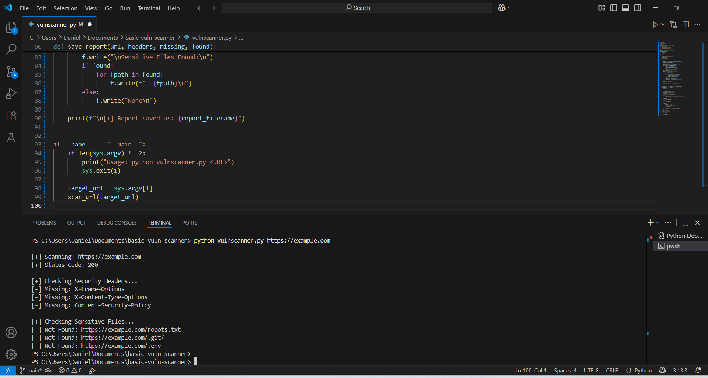

# 🛡️ Basic Vulnerability Scanner

A simple Python-based vulnerability scanner that checks for:
- Missing security headers
- Common sensitive files (`robots.txt`, `.git/`, `.env`, etc.)

This project is for **educational and portfolio purposes only**.  

---

## 📌 Features
- Sends HTTP requests to a target website.
- Displays **status codes** and **response headers**.
- Checks for common **missing security headers**:
  - `X-Frame-Options`
  - `X-Content-Type-Options`
  - `Content-Security-Policy`
- Attempts to detect sensitive files:
  - `/robots.txt`
  - `/.git/`
  - `/.env`
- Saves results into a **scan report** (optional).

---

## ⚙️ Installation

Clone the repository:
```bash
git clone https://github.com/DanielXarvy/basic-vuln-scanner.git
cd basic-vuln-scanner
```
Install dependencies:
```bash
pip install -r requirements.txt
```

## 📌 Usage
```bash
python vulnscanner.py https://example.com
```

Run the scanner with a target URL:
python vulnscanner.py https://example.com

## 📸 Screenshots


## 📂 Sample Report
```
[+] Scanning: https://example.com
[+] Status Code: 200

[+] Checking Security Headers...
[-] Missing: X-Frame-Options
[-] Missing: X-Content-Type-Options
[-] Missing: Content-Security-Policy

[+] Checking Sensitive Files...
[-] Not Found: https://example.com/robots.txt
[-] Not Found: https://example.com/.git/
[-] Not Found: https://example.com/.env
```
⚠️ Disclaimer
This project is for educational purposes only.
Do not scan websites without permission. Use only on your own projects or test environments.

✍️ Created by DanielXarvy